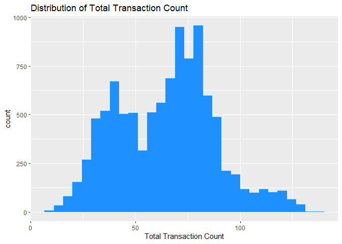
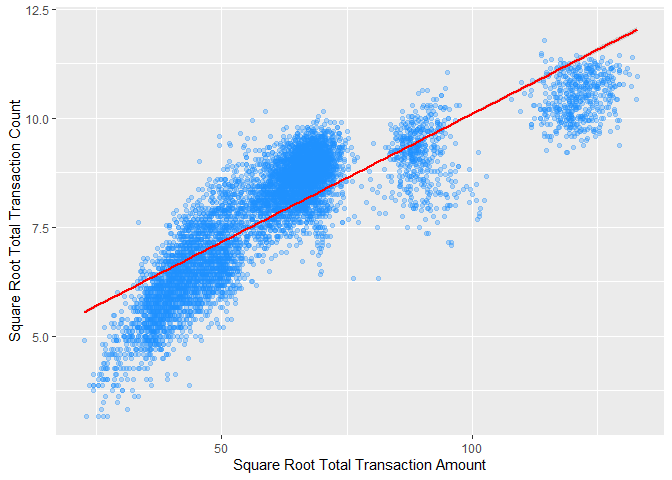
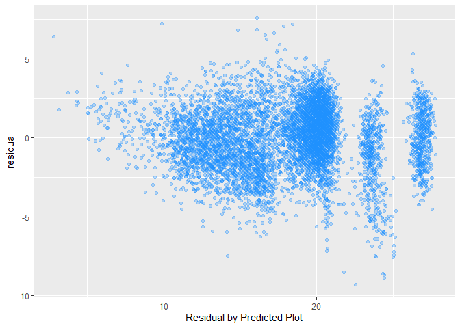
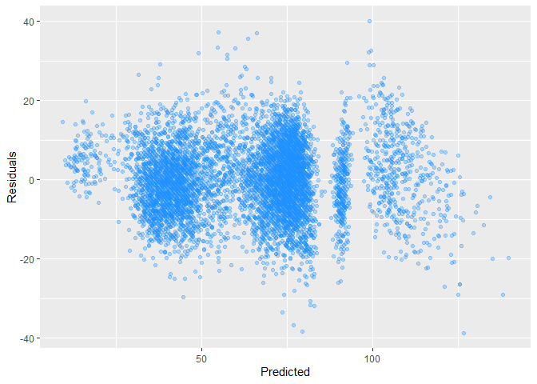
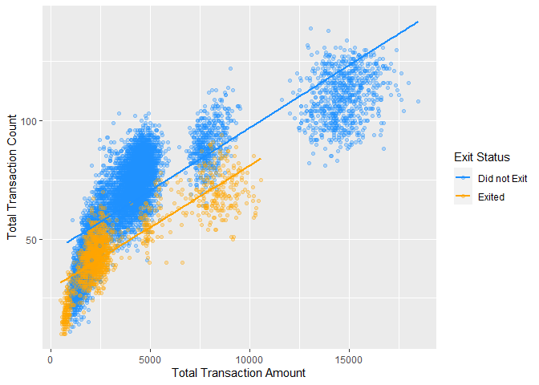

Credit Card Customer Analysis
================
Team 4: Henry Siegler, Jake Ketchner, Esteban Anderson

    ## [1] 4

## Introduction

This report is an investigation analyzing data on credit card customers
for a particular company to learn about the relationship between various
attributes of the credit card customers, such as their spending habits
and whether or not they are still current customers. The data was
obtained from kaggle [at this
link](https://www.kaggle.com/code/atillazkaymak/credit-card-customer-churn-prediction/data?select=BankChurners.csv).
The dataset is from an unknown credit card company and we only are
provided data for some of their customers that use of used to use their
credit card to some degree. We have 10,127 total observations. Each
observational unit in the study is a customer of the credit card
company, and the variables that we are focusing on are total transaction
amount in the past 12 months (in dollars), total transaction count in
the past 12 months, whether or not the customer is still with the
company (binary), total number of products held by the customer, and the
customer’s credit limit (in dollars). For the simple and multiple linear
regression sections, we are considering total transaction count in the
past 12 months the response variable. For the logistic regression
section, whether or not the customer exited is the response variable,
which is a binary variable equal to 1 if the customer exited. Initially,
we hypothesize that total transaction amount and total transaction count
would be positively and linearly related, as it makes sense for
increased spending to be associated with an increased number of
transactions. We hypothesize that total transaction count to be
negatively correlated with if the customer exited, and positively
correlated with both credit limit and total number of products held by
the customer.

## Descriptive Statistics

**Response Variable is Total Transaction Count**

    ##                    Variable     N     Mean Std. Dev.    Min Pctl. 25 Pctl. 75
    ## 1              Customer_Age 10127   46.326     8.017     26       41       52
    ## 2           Dependent_count 10127    2.346     1.299      0        1        3
    ## 3            Months_on_book 10127   35.928     7.986     13       31       40
    ## 4  Total_Relationship_Count 10127    3.813     1.554      1        3        5
    ## 5    Months_Inactive_12_mon 10127    2.341     1.011      0        2        3
    ## 6     Contacts_Count_12_mon 10127    2.455     1.106      0        2        3
    ## 7              Credit_Limit 10127 8631.954  9088.777 1438.3     2555  11067.5
    ## 8       Total_Revolving_Bal 10127 1162.814   814.987      0      359     1784
    ## 9           Avg_Open_To_Buy 10127  7469.14  9090.685      3   1324.5     9859
    ## 10     Total_Amt_Chng_Q4_Q1 10127     0.76     0.219      0    0.631    0.859
    ## 11          Total_Trans_Amt 10127 4404.086  3397.129    510   2155.5     4741
    ## 12           Total_Trans_Ct 10127   64.859    23.473     10       45       81
    ## 13      Total_Ct_Chng_Q4_Q1 10127    0.712     0.238      0    0.582    0.818
    ## 14    Avg_Utilization_Ratio 10127    0.275     0.276      0    0.023    0.503
    ## 15                   Exited 10127    0.161     0.367      0        0        0
    ## 16                     male 10127    0.471     0.499      0        0        1
    ##      Max
    ## 1     73
    ## 2      5
    ## 3     56
    ## 4      6
    ## 5      6
    ## 6      6
    ## 7  34516
    ## 8   2517
    ## 9  34516
    ## 10 3.397
    ## 11 18484
    ## 12   139
    ## 13 3.714
    ## 14 0.999
    ## 15     1
    ## 16     1

In the table above, we can see some descriptive statistics of the
variables in our dataset. None of the numeric variables have extremely
large maximum values.

<!-- --> We can see
from the correlation matrix that **Avg_Open_To_Buy** is highly
correlated with **Credit_Limit**, so we will remove **Avg_Open_To_Buy**
because it is redundant to keep both of these variables. We can see that
**Total_Trans_Ct** is highly correlated with **Total_Trans_Amt**, which
is what we would expect. **Total_Trans_Ct**, the response variable, is
moderately negatively correlated with **Total_Relationship_Count**,
which is not what we would expect, because we would expect customers
with more products with the company to have more transactions. The
response is also moderately negatively correlated with **Exited**, which
makes sense because we would expect the customers who are not using the
company now to have less total transactions.

    ## Correlation between Avg_Open_To_Buy and Credit_Limit: 0.9959805

    ##                          Total_Trans_Ct
    ## Exited                            -0.37
    ## Total_Relationship_Count          -0.24
    ## Contacts_Count_12_mon             -0.15
    ## Customer_Age                      -0.07
    ## male                              -0.07
    ## Months_on_book                    -0.05
    ## Months_Inactive_12_mon            -0.04
    ## Avg_Utilization_Ratio              0.00
    ## Total_Amt_Chng_Q4_Q1               0.01
    ## Dependent_count                    0.05
    ## Total_Revolving_Bal                0.06
    ## Credit_Limit                       0.08
    ## Total_Ct_Chng_Q4_Q1                0.11
    ## Total_Trans_Amt                    0.81
    ## Total_Trans_Ct                     1.00

Looking at the actual correlations between the response variable and all
of the explanatory variables, we can see that the variables with the
highest correlation are **Total_Trans_Amt**, **Exited**,
**Total_Relationship_Count**, and **Contacts_Count_12_mon**.

Now we will explore the **Total_Trans_Ct variable** and its relationship
with other correlated variables in our data.

<!-- -->

We see that most customers have a total transaction count in the range
of about 30 to 90 transactions in the past year.

<!-- -->

For all of the income categories, we see a bimodal distribution for the
**Total_Trans_Ct**. For people in the income category of “less than
\$40K”, we see that there is a larger spike in the second peak of the
histogram compared to the other income categories. However, looking at
the general distribution of total transaction count across the different
income levels, the distributions look pretty similar and have similar
centers and averages, so it does not appear that income category is
related to the response.

<!-- -->

We can see that the Total Transaction Counts for the customers who have
have exited has a unimodal distribution, with the center of the peak
being significantly below where most of the Transaction Counts are for
the customers who have not exited. The average total transaction count
for those who have exited appears to be about 35 transactions, but that
number is around 70 for those who have not exited. Therefore, exited
does appear to be very related to the response.

<!-- --> The
average total transactions is smaller for the groups of people with 3,
4, 5 and 6 products compared to those with only 1 or 2 products. Total
Relationship Count (total number of products a customer has), appears to
have a relationship with the response.

## Data Visualization

<!-- -->

Based on the scatterplot between total transaction count and total
transaction amount, we can see that the data appears to form 3 clusters,
and there are no customers who exited that were in the 3rd cluster.
Also, the data for both customers who exited and did not exit appears to
follow a 3rd degree polynomial relationship.

## Data Cleaning

From our descriptive statistics earlier, we found that there were no
extremely large values for any of the variables, so we have no evidence
that any of the values in the dataset are incorrect entries.

Running a simple linear regression model predicting total transction
count from total transaction amount, we see the following Cooks D
values:

All of the Cook’s D values are very low, because they are much lower
than 1. However, a few observations do stick out more than others; 2 of
the observations have values of about 0.008.

    ##          Variable     N     Mean Std. Dev. Min Pctl. 25 Pctl. 75   Max
    ## 1 Total_Trans_Amt 10127 4404.086  3397.129 510   2155.5     4741 18484
    ## 2  Total_Trans_Ct 10127   64.859    23.473  10       45       81   139

We can see that these two individuals have very high total transaction
amounts relative to the dataset as a whole. They have values of \$16,563
and \$17,744, which are well above the 75th percentile, and much closer
to the maximum value of \$18,484. Their total transaction counts are
also very high: 94 and 104. These transaction counts are higher than the
75th percentile for the data of 81. The very high values for both the
explanatory variable and the response for these individuals explains why
the Cook’s D value is so high when a linear regression is ran of these
two variables. We do not have any reason to remove those observations
because their values are correct and they are not extremely high.

## Splitting the Data

We randomly selected 80% of the observations and placed those into a
training dataset. The remaining 20% of the data were placed into a
testing dataset.

# Linear Regression

Explanatory Variable: **Total_Trans_Amt** Response Variable:
**Total_Trans_Ct**

<!-- -->

As we can see in the scatter plot, the relationship between total
transaction count and total transaction amount is not linear, so we must
apply transformations to make the relationship linear.

## Variable Pre-Processing

### Attempt \#1

First, we will try decreasing the power of the X variable, by taking the
square root. Also, we will increase the power of Y, by squaring the Y
variable.

<!-- -->

Linearity looks better, but equal error variance does not appear to be
satisfied. We have increasing variance, so we want to decrease the power
of Y to fix the unequal error variance. We will first try the square
root of Y instead of Y squared.

### Attempt \#2

<!-- -->

Equal error variance looks like it is satisfied, however linearity does
not look ideal. Therefore, we want to try to find a transformation for Y
that is between $Y^{0.5}$ and $Y^2$.

### Attempt \#3

<!-- -->

Raising total transaction count to the power of 0.8 keeps the
relationship fairly linear and maintains fairly equal error variance.
However, linearity does not look perfect, so let us continue to decrease
the power of X

### Attempt \#4

Decreasing the power of X from 0.5 to 0.1, we get the following:

<!-- --> These
transformations seem to do the best job at linearizing the data, while
retaining equal error variances.

## Residual Analysis

Therefore our current best transformations for simple linear regression
between **Total_Trans_Amt** and **Total_Trans_Ct** are:

X’ = $Total\_Trans\_Amt^{0.1}$ Y’ = $Total\_Trans\_Ct^{0.8}$

**Equal Error Variance**

<!-- --> 

Based on the residual by predicted plot and the Brown-Forsythe small p
value, we can conclude that equal error variance is not satisfied. There
residuals seem to fan out as the predicted value increases.

**Linearity**

Linearity also does not look to be fully satisfied, with an F Ratio of
1.547 and a very small p value. Two of our assumptions are already
violated so we will try new transformations.

### New Transformation

<!-- -->

**Equal Error Variance**

<!-- -->

With this new transformation, we now see that the equal error variance
assumption is now satisfied based on the large p value for the
Brown-Forsythe test.

**Linearity**

We still cannot conclude that linearity is satisfied based on the lack
of fit test. However, the F ratio decreased to 1.34, which is an
improvement from 1.547 in the previous model. The F critical value for
these degrees of freedom is 1.057, so our F ratio is not too far above
this.

**Normality of Residuals**

Although we have a small pvalue for the Anderson-Darling test, which
indicates that we do not have normality of residuals, the histogram of
the residuals looks very normally distributed, so we can conclude that
this assumption is not terribly violated.

**Independence**

Our data on the customers is sorted in a random order, so there is no
reason why the error of one observation would be related to the error of
the observation next to it. The Durbin-Watson value is 1.955, which is
very close to 2, which is the value that means there is no
autocorrelation. Our Durbin-Watson value has a pvalue of 0.03, which is
not significant at the alpha of 1% level. Since we know that our data is
in a random order, and customers are likely not influencing each other,
we can conclude that independence is satisfied.

### Unusual Observations

There are many externally studentized residuals greater than 3 in
absolute value. However, there is only 1 observation that is a large
outlier based on the Bonferroni adjustment.

    ## # A tibble: 10 × 5
    ##    residual Exited Total_Trans_Amt Total_Trans_Ct Education_Level
    ##       <dbl>  <dbl>           <dbl>          <dbl> <chr>          
    ##  1    -9.30      1            6613             40 Uneducated     
    ##  2    -8.93      1            9177             50 High School    
    ##  3    -8.71      1            9183             51 High School    
    ##  4    -8.64      1            9061             51 Uneducated     
    ##  5    -8.52      1            5806             40 Graduate       
    ##  6    -7.60      1           10201             59 Uneducated     
    ##  7    -7.53      1            8325             54 Post-Graduate  
    ##  8    -7.50      0            1893             15 Graduate       
    ##  9    -7.48      1            8260             54 High School    
    ## 10    -7.44      1           10291             60 High School

    ## # A tibble: 5 × 5
    ##   residual Exited Total_Trans_Amt Total_Trans_Ct Education_Level
    ##      <dbl>  <dbl>           <dbl>          <dbl> <chr>          
    ## 1     7.59      0            2464             92 Uneducated     
    ## 2     7.25      0            1110             58 Doctorate      
    ## 3     7.21      0            3448            103 College        
    ## 4     7.10      0            3162             99 Graduate       
    ## 5     6.87      0            2465             88 Unknown

    ##          Variable     N     Mean Std. Dev. Min Pctl. 25 Pctl. 75   Max
    ## 1 Total_Trans_Amt 10127 4404.086  3397.129 510   2155.5     4741 18484
    ## 2  Total_Trans_Ct 10127   64.859    23.473  10       45       81   139

We can see that the customers with the largest negative residuals almost
all exited the company and had high transaction amounts and lower
transaction counts. For the customers with the largest positive
residuals, none of them have exited the company, and they have much
lower transaction amounts and high transaction counts.

Looking at the Cook’s D Influence values, only a couple of the
observations stick out from the others. The Cook’s D values are low,
since values of 0.5 or greater indicate that the observation is
influential. However, since one of the observations has a much higher
Cook’s D value than the other points, that observation is likely
influential.

    ## # A tibble: 1 × 5
    ##   residual Exited Total_Trans_Amt Total_Trans_Ct Education_Level
    ##      <dbl>  <dbl>           <dbl>          <dbl> <chr>          
    ## 1     6.42      1             510             24 College

This customer has a very low total transaction amount and a low total
transaction count, which may be the reason for why it has a Cook’s D
value so much greater than the other observations.

## Fit a Linear Model

Final Model:

$X' = Total\_Trans\_Amt^{-0.2}$ $Y' = Total\_Trans\_Ct^{0.7}$

<!-- -->

The model above did not terribly violate any of the assumptions required
for simple linear regression models, so the predictions and implications
of our model should be fairly accurate and trustsworthy. The model does
not account for omitted variable bias, which means that we cannot
interpret the slope coefficient as a causual effect of transaction
amount on transaction count.

    ## 
    ## Call:
    ## lm(formula = I(Total_Trans_Ct^0.7) ~ I(Total_Trans_Amt^-0.2), 
    ##     data = training_data)
    ## 
    ## Residuals:
    ##     Min      1Q  Median      3Q     Max 
    ## -9.2956 -1.2705  0.1116  1.3894  7.5944 
    ## 
    ## Coefficients:
    ##                          Estimate Std. Error t value Pr(>|t|)    
    ## (Intercept)               51.9397     0.1839   282.4   <2e-16 ***
    ## I(Total_Trans_Amt^-0.2) -170.8788     0.9247  -184.8   <2e-16 ***
    ## ---
    ## Signif. codes:  0 '***' 0.001 '**' 0.01 '*' 0.05 '.' 0.1 ' ' 1
    ## 
    ## Residual standard error: 1.979 on 7087 degrees of freedom
    ## Multiple R-squared:  0.8281, Adjusted R-squared:  0.8281 
    ## F-statistic: 3.415e+04 on 1 and 7087 DF,  p-value: < 2.2e-16

$\widehat{Total\_Trans\_Ct}_i'=51.94 -170.88 Total\_Trans\_Amt_i'$

The model does make sense contextually because the X variable was
transformed so that it was raised to the power of -0.2, so the negative
coefficient for the slope means that there is a positive relationship
between the untransformed variables. The variables have been transformed
greatly, so the coefficient estimates do not make sense to interpret.

The model did a good job of explaining variation in transaction count,
as the R-squared value is 0.8281. Therefore, 82.8% of the variation in
the total transaction count transformed variable is explained by the
model. The root mean square error of the model is 1.977, which is the
typical deviation of the actual Y value from the predicted Y value.

To interpret the intercept of the estimated regression equation, we can
say that the estimated total transaction count to the power of 0.7 is
51.9 when the total transaction amount is zero. This intercept does make
sense in context, however the minimum value of total transaction amount
in the data was \$510, so it may not be meaningful. For a 1 unit
increase in the tranaction amount to the power of -0.2, the transaction
count to the power of 0.7 decreases by 170.88.

## Statistical Inference

$H_0$: The model is not significant. $H_A$: The model is significant.

The F ratio for the test of overall model significance is 34,217, which
is very large, meaning that we can conclude that our model is
significant.

### Confidence Interval and Prediction Interval

    ##        fit      lwr      upr
    ## 1 21.94403 21.88345 22.00462

    ##        fit      lwr      upr
    ## 1 21.94403 18.06353 25.82453

We are interested in calculating confidence intervals for the mean of
individuals with transaction amounts of \$6000, because there is a large
cluster of customers who spent about that much total.

For customers with transaction amounts of \$6000, we are 95% confident
that the true mean transaction count to the power of 0.7 is between
21.88 and 22.004.

For a single new customer with a transaction amount of \$6000, we are
95% confident that that customer’s actual transaction count to the power
of 0.7 is between 18.06 and 25.82.

## Model Validation

    ## Correlation between testing data predictions and actual values 0.9109818

Using the linear regression model that was built using the training
data, we calculate the predicted values for all the observations in the
testing data. The correlation between those predicted values and the
actual response values for the testing data is 0.9109, which is a very
high correlation, meaning that our model still did a good job at
predicting out of sample values.

## Conclusion

In order to investigate the relationship between transaciton amount and
transaction count over the past 12 months for all of the customers of
the credit card company in the dataset, we first had to transform our
variables so that the assumptions for simple linear regression were met.
Linearity and equal error variance were clearly not met before we
applied transformations to the variables. After transforming the
variables, equal error variance was satisfied, linearity was very close
to being satisfied even although the lack fit test was not passed, and
normality of errors looked satisfied. The final transformed model did a
very good job in explaining variation in the response, with an R squared
value of 0.8281. The model utility test demonstrated that our model is
very significant, and we see that we have very statistically
significants for the coefficient estimates for the intercept and the
explanatory variable. There were not any extremely large residuals in
our model, and there was only a couple of observations that could have
been influential.

In terms of finding the best transformations, many different
combinations of transformations were attemped, and none of them seemed
to fully remedy the linearity assumption, however the data does seem to
have a linear form, so any conclusions made from the model should be
close to accurate, as no assumptions were highly violated. We would have
liked to have found a model that satisfied the lack of fit test, however
we reduced the F ratio for this test to be not too high, which we felt
was the best we could have done. We expected a positive correlation
between these two variables, which is what we discovered. We found that
the largest residuals in absolute value in our model were negative
residuals, meaning that the model over predicted the response for these
observations. We found it interesting that almost all of the
observations with the largest negative residuals were individuals that
had exited the credit card company. We found it interesting that one of
the observations had a much higher Cook’s D value than the others, but
this customer had the minimum total transaction amount at \$510.

One thing that we were not fully content with in our analysis is that
the customers that we received information on were not all of the
customers of the credit card company. The minimum value of the total
transaction amount variable in the dataset was \$510, so these customers
all used their cards a reasonable amount. Also, there were no customers
with extremely large values for any of the variables, such as
transaction amount or credit limit, so it would have been nicer to know
more about how this data was collected.

# Multiple Regression

**Response Variable: Total Transaction Count** **Explanatory Variables:
Total transaction amount, Exited (qualitative), Total relationship
count, Credit Limit**

## Data Visualization

<!-- -->

    ##                          Total_Trans_Ct Total_Trans_Amt      Exited
    ## Total_Trans_Ct               1.00000000       0.8070911 -0.37394933
    ## Total_Trans_Amt              0.80709113       1.0000000 -0.16994394
    ## Exited                      -0.37394933      -0.1699439  1.00000000
    ## Total_Relationship_Count    -0.23952972      -0.3508442 -0.14898082
    ## Credit_Limit                 0.07739854       0.1674287 -0.02450111
    ##                          Total_Relationship_Count Credit_Limit
    ## Total_Trans_Ct                        -0.23952972   0.07739854
    ## Total_Trans_Amt                       -0.35084421   0.16742873
    ## Exited                                -0.14898082  -0.02450111
    ## Total_Relationship_Count               1.00000000  -0.06403857
    ## Credit_Limit                          -0.06403857   1.00000000

The explanatory variable that seems most strongly associated with
transaction count is total transaction amount with a correlation of
0.807. Exit status also seems moderately correlated with the response,
with a correlation of -0.37. We know that total transaction count and
total transaction amount do not have a completely linear relationship,
from our investigation in the simple linear regression section. Exit
status is a binary variable so we are not worried about having a linear
relationship with that variable and the response. None of the
explanatory variables are highly correlated with each other, although
total transaction amount and total relationship count do have a
correlation of -0.35, but that is not extremely high. All of the
variables behaved as we would had expected, since increased transactions
in amount and by count are positively correlated with credit limit, and
negatively correlated with exit status. However, we found it unusual
that total relationship count (the number of products held by the
customer), is negatively correlated with transaction count and amount.

Based on the graph above of with the interaction between Exit and total
transaction amount, we can see that there is almost no interaction
between these variables because the slopes of the lines look almost
perfectly parallel. The interaction term in the model allows the slope
between the X and Y variables to be different for customers who exited
and did not exit, and since the slopes look parallel we would expect the
interaction term to not be significant.

## Variable Pre-Processing

Initial residual vs predicted plot with all of the untransformed
variables:

The original plot of total transaction count vs Total relationship
amount had linearity issues with a high F ratio of 61.46 in the Lack of
Fit Test, and a small p value of \<0.0001.

After transforming the data by raising total relationship count to the
power of 0.5 we were able to attain a more linear model. Although it
does not satisfy the lack of fit test, it is an improvement. If we
wanted to satisfy the lack of fit test we would most likely have to
transform the Y variable which would increase the complexity of our
model and force us to transform the other X variables as well.

From the analysis in the simple linear regression portion, we know that
total transaction count and total transaction amount do not have a
linear relationship. Therefore, we will raise total transaction amount
to the power of 0.001 and assess the linearity.

After transforming total transaction amount by raising it to the power
of 0.001, we were able to attain a more linear model. Although it does
not satisfy the lack of fit test, it is a large improvement from the
untransformed variables. If we wanted to satisfy the lack of fit test we
would most likely have to transform the Y variable which would increase
the complexity of our model and force us to transform the other X
variables as well.

Our final model is:

**Response Variable: Total Transaction Count** **Explanatory Variables:
Total transaction Amount to the power of 0.001, Exited (qualitative),
Total relationship count to the power of 0.5, Credit Limit**

## Residual Analysis

Now we will check the assumptions of our model.

**Linearity**

Looking at the predicted values versus residual plot, we can see that
the say that linearity is met, as well as equal error variance, as there
is no fanning pattern in the data and the residual line of zero goes
through the middle of the data generally.

The lack of fit test also suggested that linearity is satisfied, as the
p value is 0.568 resulting in accepting the null hypothesis that
linearity is satisfied.

**Independence of Errors**

We can say that the independence of errors assumption is satisfied
because each of the customers in the dataset are likely independent of
each other and are not influencing each other in terms of their
transactions and the other variables in the model. The dataset is also
sorted in a random order with no time series component. Also, with a
Durbin-Watson value of 1.97, we can conclude there is no
autocorrelation.

We also look at the residual vs row order plot, which shows no pattern,
so we can conclude independence.

**Normality of Residuals**

Despite a low p-value for the Anderson-Darling test, which indicates
that the residuals are not normal, the histogram of the residuals
appears very normally distributed, so we can conclude that the normality
of residuals assumption is satisfied for this analysis.

Based on all of the tests to check the assumptions, none of the
assumptions are highly violated, so we can conclude that all of the
assumptions of multiple linearity regression are met, so we can move
forward with the model without worrying about inaccurate results. Our
sample size is so large that perfectly satisfying all of the tests is
not fully necessary, as long as the assumptions look generally
satisfied.

## Fit a Multiple Linear Regression Model

$\widehat{Total\_Trans\_Ct} = -30,982 + 30,786Total\_Trans\_Amt^{0.001} - 0.55Total\_Relationship\_Count^{0.5} + 11.3Exited[0] - 0.00007Credit\_Limit$

Certain aspects of our model do not make much sense contextually. For
example, an intercept of -30,982 does not make sense in context, because
that is a negative transaction count. However, there are no observations
in the dataset with any values for total transaction count close to 0,
which is why the intercept is negative. Therefore, extrapolating
predictions from this model would provide us with invalid predictions.
By transforming two of the variables we expect a more difficult
interpretation of the model’s parameter estimates. The initial model
without transformations had an intercept of 38.025 and a total
transaction amount slope of 0.0053 which make more sense in context of
the problem. Our current model shows the relationship between the
response variable, total transaction count, and the four explanatory
variables; exited, total relationship count, credit limit, and total
transaction amount after they have been transformed.

Overall, our model does a very good good of explaining variation in the
total transaction count. There is an R squared adjusted value of 0.852.
This means that 85.2% of the variation in total transaction count is
explained by the explanatory variables in the model, after accounting
for the number of predictor variables in the model.The error of our
model or, root mean square error, is 8.99 that the average absolute
value of the error of our model in predicting total transaction count is
8.99.

The interpretation of the intercept is that the average predicted total
number of transactions is -30,982 for an individual that does not spend
any amount, has 0 products with the company, has exited the company, and
has a credit limit of 0. The coefficient of the exited variable can be
interpreted as when the other variables constant, customers who have not
exited make 11.3 more transactions on average compared to customers who
have exited. We can also interpret the coefficient estimate of the
credit limit. With an increase of \$1000 in a customer’s credit limit,
the predicted transaction count decreases by 0.07 on average, holding
all of the other variables constant.

To check the model for multicollinearity, we will analyze the variance
inflation factors (VIF) for each of the explanatory variables. A maximum
VIF value greater than 10 indicates that multicollinearity is
influencing the least squares estimate. The largest VIF is on the total
relationship count variable, with a value of 1.17, which is not high at
all and very close to 1. It says that the variance of the estimated
slope of total relationship count is increased 1.17 times due to the
correlation with the other variables in the model. Since all the VIF
values are low, we can conclude that multicollinearity is not
influencing our model.

## Statistical Inference

**Model Utility Test**

Ho: All of the coefficients in the model are equal to 0 or the model is
not significant Ha: At least one of the coefficients in the model does
not equal 0 or the model is significant

With a p value of \<0.0001 for the model utility test, we reject the
null hypothesis and conclude that our model is significant.

**F Partial Test**

We will compare our model to a model with only one explanatory variable:
Total transaction amount to the power of 0.001, which is a variable in
the full model.

Ho: All of the coefficients in the full model not in the reduced model
are equal to 0 Ha: At least one of the coefficients in the full model
not in the reduced model is not equal to 0

F = \[ (691,464 - 573,585) / (7087 - 7084) \] / 81 = 485.09

The F value for the F partial test is 485 with an associated p value
value of \<0.0001, so we conclude that at least one coefficient removed
from the full model does not equal zero and therefore our full model is
significantly better than the reduced model with only total transaction
amount to the pwoer of 0.001.

**Interaction Analysis**

In the graph for the interaction between Exit and total transaction
amount with the response variable being transaction count, we will
investigate whether or not the interaction term is significant.

Ho: The relationship between total transaction amount and total
transaction count does not change depending on if a customer has exited
or not. Ho: The relationship between total transaction amount and total
transaction count changes depending on if a customer has exited or not.

The t test for the test of significance of the interaction term has one
degree of freedom and t ratio of 0.32. The associated p value is 0.75,
so we can conclude that the relationship between total transaction
amount and total transaction count does not change depending on if a
customer has exited or not. This matches the graph from above, because
the lines for the customers that exited and did not exit look almost
perfectly parrellel, suggesting that there is no interaction.

**Confidence and Prediction Intervals**

    ##        fit      lwr      upr
    ## 1 83.08467 82.78835 83.38098

    ##        fit      lwr      upr
    ## 1 83.08467 65.42246 100.7469

We would like to predict a confidence interval for the mean transaction
counts and a prediction interval for the transaction counts for a given
customer. For a customers that have a transaction amount of \$6,0000, a
credit limit of \$11,000, four total products, and did not Exit, we are
95% confident that the mean total transaction count is between 82.78 and
83.38 transactions. For a single customer with these same combination of
attributes, we are 95% confident that the customer’s total transaction
count will be between 65.42 and 100.74 transactions, which is a much
larger range than the confidence interval. This choice of explanatory
variables is of interest because there are many customers with this
combination of attributes, and we would like to see the intervals for
customers who spend more than most customers, which is why we choose a
transaction count of \$6,000.

**Possible Extra: Richer Model and Interpretation**

<!-- -->

Based on the shape of the data in the scatterplot between total
transaction amount and total transaction count, we can see that a third
degree polynomial explains the shape of the data well.

We will add the squares and cubed transaction amount terms to the model,
as well as a categorical variable for marital status, which has four
different categories: divorced, single, married, and unknown. We will
one-hot encode these variables and we will use marital status of single
as the baseline. We will also include total relationship count and exit
status into the model.

<!-- --> Looking at
the predicted vs residual plot for the richer model, we can see that
linearity and equal error variance are reasonably satisfied.

    ## 
    ## Call:
    ## lm(formula = Total_Trans_Ct ~ Total_Trans_Amt + I(Total_Trans_Amt^2) + 
    ##     I(Total_Trans_Amt^3) + Marital_StatusDivorced + Marital_StatusMarried + 
    ##     Marital_StatusUnknown + Total_Relationship_Count + Exited, 
    ##     data = one_hot_training)
    ## 
    ## Residuals:
    ##     Min      1Q  Median      3Q     Max 
    ## -38.622  -6.098   0.053   5.845  40.044 
    ## 
    ## Coefficients:
    ##                            Estimate Std. Error t value Pr(>|t|)    
    ## (Intercept)               1.000e+01  6.370e-01  15.706  < 2e-16 ***
    ## Total_Trans_Amt           2.380e-02  2.998e-04  79.384  < 2e-16 ***
    ## I(Total_Trans_Amt^2)     -2.316e-06  4.932e-08 -46.968  < 2e-16 ***
    ## I(Total_Trans_Amt^3)      7.851e-11  2.145e-12  36.601  < 2e-16 ***
    ## Marital_StatusDivorced   -3.390e-01  4.240e-01  -0.800  0.42400    
    ## Marital_StatusMarried    -1.282e+00  2.331e-01  -5.500 3.94e-08 ***
    ## Marital_StatusUnknown    -1.353e+00  4.225e-01  -3.203  0.00137 ** 
    ## Total_Relationship_Count -2.308e-01  7.610e-02  -3.033  0.00243 ** 
    ## Exited                   -1.072e+01  3.093e-01 -34.653  < 2e-16 ***
    ## ---
    ## Signif. codes:  0 '***' 0.001 '**' 0.01 '*' 0.05 '.' 0.1 ' ' 1
    ## 
    ## Residual standard error: 8.9 on 7080 degrees of freedom
    ## Multiple R-squared:  0.8554, Adjusted R-squared:  0.8553 
    ## F-statistic:  5237 on 8 and 7080 DF,  p-value: < 2.2e-16

When we look at the coefficient estimates in the model, we can see that
the coefficients on the squared and cubed terms for transaction amount
are both significant, which suggests that a cubic term for this variable
is appropriate for explaining the data. We also have significant
coefficient estimates for married and unknown marital status, meaning
that when holding the other variables constant, there is a significant
difference in transaction counts between single customers and married
customers, and single customers and customers with an unknown marital
status. In particular, married and customers of unknown marital status
make about one fewer transaction than single customers, holding the
other variables constant. The coefficient for the divorced estimate is
not significant, meaning that predicted transaction count is not
different between single and divorced customers, holding all of the
other variables constant.

The adjusted R-squared value for this model is 0.855, which is only
slightly higher than the adjusted R-squared value in our original
multiple linear regression model of 0.852.

## Model Validation

Using the original multiple linear regression model without the
polynomial terms for transaction amount, we will predict values for the
testing data using the model from the training data and evaluate the
results.

    ## Correlation between testing data predictions and actual values 0.9230898

    ## [1] 9.095798

Using the coefficients of the model created using the training data, we
predicted all of the values for the testing data. The correlation
between those predicted values and the actual transaction counts for the
testing data customers is 0.92, which is a high correlation, suggesting
that our model does a good job of predicting values out of sample. Also,
the root mean square error found from the testing data actual values and
their predicted values is 9.05, which is only slightly higher than the
root mean square error of the training model, which was 8.99. This also
suggests that our model has not been overfit to the training data
because it is still very good at predicting values for customers that
were not in the dataset used to create the model.

## Conclusion

Overall, the final model is very strong and it predicts the total
transaction count of customers fairly accurately, with a typical
deviation of actual values from predicted values of 9, which is very
close considering the average transaction count is 65 transactions. The
model is not overfit to the training data, as it does just about as good
at predicting values out of sample in the testing dataset as it does
predicting values in the training dataset. The overall model utility
test suggests that our model is very significant in predicting
transaction count for these customers of this company.

The model is valid, as it generally satisfies all of the assumptions
required for multiple linear regression models. One weakness of the
model is that it is only a slight improvement in predicting transaction
count compared to the simple linear regression model with only
transaction amount transformed as a predictor variable. The R squared
values for both of these models are similar, and our model is more
complex due to the extra terms that were added to the model.

The final does tell us a few things about the total transaction counts
for customers. It tells us customers that have not exited generally have
more transactions compared to customers that exited, so if a customer is
not engaging in as many transactions, they are more likely to exit.
Also, as the total number of products held by a customer increases, the
less transactions the customer has on average, holding the other
variables constant. Also, we can see that increased transaction amounts
are associated with higher transaction counts, holding the other
variables constant.

It would be beneficial to one hot encode all of the categorical
variables in the dataset, such as income level and education status, and
compare how the different education or income levels relate to the
transaction counts when holding other variables constant.

# Logistic Regression

## Descriptive Statistics

**Binary Response Variable: Exited (1 Meaning the Customer Exited or
Left the Company)**

<!-- -->

<!-- -->

<!-- -->

# Appendix
