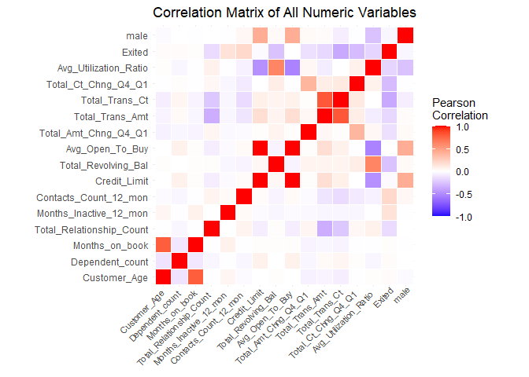
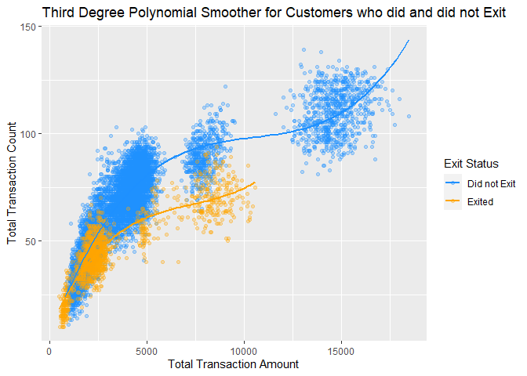

Credit Card Customer Analysis
================
Henry Siegler, Jake Ketchner, Esteban Anderson, Alex Fugate

``` r
library(tidyverse)
library(here)
library(reshape2)
library(vtable)
```

## Introduction

This report is an investigation analyzing data on credit card customers
for a particular company to learn about the relationship between various
attributes of the credit card customers, such as their spending habits
and whether or not they are still current customers. The data was
obtained from kaggle [at this
link](https://www.kaggle.com/code/atillazkaymak/credit-card-customer-churn-prediction/data?select=BankChurners.csv).
The dataset is from an unknown credit card company and we only are
provided data for some of their customers that use of used to use their
credit card to some degree. We have 10,127 total observations. Each
observational unit in the study is a customer of the credit card
company, and the variables that we are focusing on are total transaction
amount in the past 12 months (in dollars), total transaction count in
the past 12 months, whether or not the customer is still with the
company (binary), total number of products held by the customer, and the
customer’s credit limit (in dollars). For the simple and multiple linear
regression sections, we are considering total transaction count in the
past 12 months the response variable. For the logistic regression
section, whether or not the customer exited is the response variable,
which is a binary variable equal to 1 if the customer exited. Initially,
we hypothesize that total transaction amount and total transaction count
would be positively and linearly related, as it makes sense for
increased spending to be associated with an increased number of
transactions. We hypothesize that total transaction count to be
negatively correlated with if the customer exited, and positively
correlated with both credit limit and total number of products held by
the customer.

``` r
data <- read_csv(here("BankChurners.csv", "BankChurners.csv"))
```

``` r
data <- data %>% 
  mutate(Exited = case_when(Attrition_Flag == "Existing Customer" ~ 0,
                              Attrition_Flag == "Attrited Customer" ~ 1),
         male = case_when(Gender == "M" ~ 1,
                          Gender == "F" ~ 0),
         ) %>% 
  select(-Naive_Bayes_Classifier_Attrition_Flag_Card_Category_Contacts_Count_12_mon_Dependent_count_Education_Level_Months_Inactive_12_mon_1,
         -Naive_Bayes_Classifier_Attrition_Flag_Card_Category_Contacts_Count_12_mon_Dependent_count_Education_Level_Months_Inactive_12_mon_2,
         -Gender,
         -Attrition_Flag,
         -CLIENTNUM)
```

## Descriptive Statistics

**Response Variable is Total Transaction Count**

``` r
descriptive_stats <- data %>% 
  select_if(is.numeric) %>% 
  st(out = "return")

descriptive_stats
```

    ##                    Variable     N     Mean Std. Dev.    Min Pctl. 25 Pctl. 75
    ## 1              Customer_Age 10127   46.326     8.017     26       41       52
    ## 2           Dependent_count 10127    2.346     1.299      0        1        3
    ## 3            Months_on_book 10127   35.928     7.986     13       31       40
    ## 4  Total_Relationship_Count 10127    3.813     1.554      1        3        5
    ## 5    Months_Inactive_12_mon 10127    2.341     1.011      0        2        3
    ## 6     Contacts_Count_12_mon 10127    2.455     1.106      0        2        3
    ## 7              Credit_Limit 10127 8631.954  9088.777 1438.3     2555  11067.5
    ## 8       Total_Revolving_Bal 10127 1162.814   814.987      0      359     1784
    ## 9           Avg_Open_To_Buy 10127  7469.14  9090.685      3   1324.5     9859
    ## 10     Total_Amt_Chng_Q4_Q1 10127     0.76     0.219      0    0.631    0.859
    ## 11          Total_Trans_Amt 10127 4404.086  3397.129    510   2155.5     4741
    ## 12           Total_Trans_Ct 10127   64.859    23.473     10       45       81
    ## 13      Total_Ct_Chng_Q4_Q1 10127    0.712     0.238      0    0.582    0.818
    ## 14    Avg_Utilization_Ratio 10127    0.275     0.276      0    0.023    0.503
    ## 15                   Exited 10127    0.161     0.367      0        0        0
    ## 16                     male 10127    0.471     0.499      0        0        1
    ##      Max
    ## 1     73
    ## 2      5
    ## 3     56
    ## 4      6
    ## 5      6
    ## 6      6
    ## 7  34516
    ## 8   2517
    ## 9  34516
    ## 10 3.397
    ## 11 18484
    ## 12   139
    ## 13 3.714
    ## 14 0.999
    ## 15     1
    ## 16     1

``` r
data %>% 
  select_if(is.numeric) %>% 
  cor() %>% 
  round(2) %>% 
  melt() %>% 
  ggplot(aes(Var1, Var2, fill = value)) + 
  geom_tile(color = "white") + 
  scale_fill_gradient2(low = "blue", high = "red", mid = "white", 
                       midpoint = 0, limit = c(-1,1), space = "Lab", 
                       name="Pearson\nCorrelation") +
  theme_minimal() + 
  theme(axis.text.x = element_text(angle = 45, vjust = 1.1, size = 8, hjust = 1.1),
        axis.title.x = element_blank(),
        axis.title.y = element_blank()) + 
  coord_fixed() + 
  labs(title = "Correlation Matrix of All Numeric Variables")
```

<!-- --> We can see
from the correlation matrix that **Avg_Open_To_Buy** is highly
correlated with **Credit_Limit**, so we will remove **Avg_Open_To_Buy**
because it is redundant to keep both of these variables. We can see that
**Total_Trans_Ct** is highly correlated with **Total_Trans_Amt**, which
is what we would expect. **Total_Trans_Ct**, the response variable, is
moderately negatively correlated with **Total_Relationship_Count**,
which is not what we would expect, because we would expect customers
with more products with the company to have more transactions. The
response is also moderately negatively correlated with **Exited**, which
makes sense because we would expect the customers who are not using the
company now to have less total transactions.

``` r
cor <- cor(data$Avg_Open_To_Buy, data$Credit_Limit)
cat("Correlation between Avg_Open_To_Buy and Credit_Limit:", cor)
```

    ## Correlation between Avg_Open_To_Buy and Credit_Limit: 0.9959805

``` r
data <- data %>% 
  select(-Avg_Open_To_Buy)
```

``` r
cor_matrix <- cor(data %>% 
                    select_if(is.numeric)) %>% 
  round(2)

cor_matrix %>% 
  as.data.frame() %>% 
  select(Total_Trans_Ct) %>% 
  arrange(Total_Trans_Ct)
```

    ##                          Total_Trans_Ct
    ## Exited                            -0.37
    ## Total_Relationship_Count          -0.24
    ## Contacts_Count_12_mon             -0.15
    ## Customer_Age                      -0.07
    ## male                              -0.07
    ## Months_on_book                    -0.05
    ## Months_Inactive_12_mon            -0.04
    ## Avg_Utilization_Ratio              0.00
    ## Total_Amt_Chng_Q4_Q1               0.01
    ## Dependent_count                    0.05
    ## Total_Revolving_Bal                0.06
    ## Credit_Limit                       0.08
    ## Total_Ct_Chng_Q4_Q1                0.11
    ## Total_Trans_Amt                    0.81
    ## Total_Trans_Ct                     1.00

Looking at the actual correlations between the response variable and all
of the explanatory variables, we can see that the variables with the
highest correlation are **Total_Trans_Amt**, **Exited**,
**Total_Relationship_Count**, and **Contacts_Count_12_mon**.

Now we will explore the **Total_Trans_Ct variable** and its relationship
with other correlated variables in our data.

``` r
data %>% 
  ggplot(aes(x = Total_Trans_Ct)) + 
  geom_histogram(fill = "dodgerblue") + 
  labs(x= "Total Transaction Count",
       title = "Distribution of Total Transaction Count")
```

<!-- -->

``` r
data %>% 
  ggplot(aes(x = Total_Trans_Ct)) + 
  geom_histogram() + 
  facet_wrap(~ Income_Category, ncol = 1) + 
  labs(x = "Total Transaction Count")
```

<!-- -->

For all of the income categories, we see a bimodal distribution for the
**Total_Trans_Ct**. For people in the income category of “less than
\$40K”, we see that there is a larger spike in the second peak of the
histogram compared to the other income categories. However, looking at
the general distribution of total transaction count across the different
income levels, the distributions look pretty similar and have similar
centers and averages, so it does not appear that income category is
related to the response.

``` r
data %>% 
  ggplot(aes(x = Total_Trans_Ct)) + 
  geom_histogram() + 
  facet_wrap(~ Exited, nrow = 2) + 
  labs(x = "Total Transaction Count",
       title = "Distribution of Total Transaction Count by Exit Status")
```

<!-- -->

We can see that the Total Transaction Counts for the customers who have
have exited has a unimodal distribution, with the center of the peak
being significantly below where most of the Transaction Counts are for
the customers who have not exited. The average total transaction count
for those who have exited appears to be about 35 transactions, but that
number is around 70 for those who have not exited. Therefore, exited
does appear to be very related to the response.

``` r
data %>% 
  group_by(Total_Relationship_Count) %>% 
  summarise(mean(Total_Trans_Ct))
```

    ## # A tibble: 6 × 2
    ##   Total_Relationship_Count `mean(Total_Trans_Ct)`
    ##                      <dbl>                  <dbl>
    ## 1                        1                   79.6
    ## 2                        2                   77.1
    ## 3                        3                   62.1
    ## 4                        4                   61.8
    ## 5                        5                   60.8
    ## 6                        6                   60.2

``` r
data %>% 
  ggplot(aes(x = as.factor(Total_Relationship_Count),
             y = Total_Trans_Ct)) + 
  geom_bar(stat = "summary",
           fun = mean,
           fill = "dodgerblue") + 
  labs(x = "Total Number of Products the Customer Has", 
        y= "Average Total Transaction Count")
```

<!-- --> The
average total transactions is smaller for the groups of people with 3,
4, 5 and 6 products compared to those with only 1 or 2 products. Total
Relationship Count (total number of products a customer has), appears to
have a relationship with the response.

### Data Visualization

``` r
data %>% 
  ggplot(aes(x = Total_Trans_Amt, y = Total_Trans_Ct, color = as.factor(Exited))) + 
  geom_point(alpha = 0.3) + 
  geom_smooth(method = "lm", formula = y ~ poly(x, 3), se = FALSE) + 
  labs(x = "Total Transaction Count", 
       y = "Total Transaction Amount",
       color = "Exit Status",
       title = "Third Degree Polynomial Smoother for Customers who did and did not Exit") + 
  scale_color_manual(labels = c("Did not Exit", "Exited"), values = c("dodgerblue", "orange"))
```

<!-- -->

Based on the scatterplot between total transaction count and total
transaction amount, we can see that the data appears to form 3 clusters,
and there are no customers who exited that were in the 3rd cluster with
the highest values. Also, the data for both customers who exited and did
not exit appears to follow a 3rd degree polynomial relationship pretty
well.

## Splitting the Data

``` r
set.seed(9)
data$id <- 1:nrow(data)

training_data <- data %>% 
  sample_frac(0.7)

test_data <- data %>% 
  anti_join(training_data, by = 'id')
```

We randomly selected 80% of the observations and placed those into a
training dataset. The remaining 20% of the data were placed into a
testing dataset.

# Linear Regression

Explanatory Variable: **Total_Trans_Amt** Response Variable:
**Total_Trans_Ct**

As we can see in the scatter plot, the relationship between total
transaction count and total transaction amount is not linear, so we must
apply transformations to make the relationship linear.

### Attempt \#1

First, we will try decreasing the power of the X variable, by taking the
square root. Also, we will increase the power of Y, by squaring the Y
variable.

``` r
training_data %>% 
  ggplot(aes(x = Total_Trans_Amt^0.5, y = Total_Trans_Ct^2)) + 
  geom_point(alpha = 0.3, color = "dodgerblue") + 
  labs(x = "Square Root Total Transaction Amount",
       y = "Total Transaction Count Squared") + 
  geom_smooth(method = "lm", color = "red")
```

<!-- -->

Linearity looks better, but equal error variance does not appear to be
satisfied. We have increasing variance, so we want to decrease the power
of Y to fix the unequal error variance. We will first try the square
root of Y instead of Y squared.

### Attempt \#2

``` r
training_data %>% 
  ggplot(aes(x = sqrt(Total_Trans_Amt), y = sqrt(Total_Trans_Ct))) +
  geom_point(alpha = 0.3, color = "dodgerblue") + 
  labs(x = "Square Root Total Transaction Amount",
       y = "Square Root Total Transaction Count") + 
  geom_smooth(method = "lm", color = "red")
```

<!-- -->

Equal error variance looks like it is satisfied, however linearity does
not look ideal. Therefore, we want to try to find a transformation for Y
that is between

and
.

### Attempt \#3

``` r
training_data %>% 
  ggplot(aes(x = sqrt(Total_Trans_Amt), y = Total_Trans_Ct^0.8)) + 
  geom_point(alpha = 0.3, color = "dodgerblue") + 
  labs(x = "Square Root Total Transaction Amount",
       y = "Total Transaction Count to the Power of 0.8") + 
  geom_smooth(method = "lm", color = "red")
```

<!-- -->

Raising total transaction count to the power of 0.8 keeps the
relationship fairly linear and maintains fairly equal error variance.
However, linearity does not look perfect, so let us continue to decrease
the power of X

### Attempt \#4

Decreasing the power of X from 0.5 to 0.1, we get the following:

``` r
training_data %>% 
  ggplot(aes(x = Total_Trans_Amt^0.1, y = Total_Trans_Ct^0.8)) + 
  geom_point(alpha = 0.3, color = "dodgerblue") + 
  labs(x = "Square Root Total Transaction Amount",
       y = "Total Transaction Count to the Power of 0.8") + 
  geom_smooth(method = "lm", color = "red")
```

<!-- --> These
transformations seem to do the best job at linearizing the data, while
retaining equal error variances.

Therefore our final transformations for simple linear regression between
**Total_Trans_Amt** and **Total_Trans_Ct** are:

X’ =

Y’ =


## Residual Analysis

**Equal Error Variance**

``` r
model <- lm(I(Total_Trans_Ct^0.8) ~ I(Total_Trans_Amt^0.1), data = training_data)
training_data$predictions <- predict(model)
training_data$residual <- training_data$Total_Trans_Ct^0.8 - training_data$predictions
```

``` r
training_data %>% 
  ggplot(aes(x = predictions, y = residual)) + 
  geom_point(color = "dodgerblue", alpha = 0.3) + 
  labs(x = "Residual by Predicted Plot")
```

<!-- -->

**Linearity**


