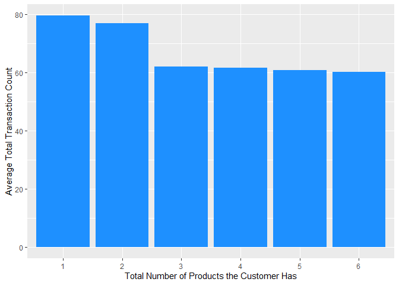

Credit Card
================
Henry Siegler
2022-11-25

``` r
library(tidyverse)
library(here)
library(reshape2)
library(vtable)
```

``` r
data <- read_csv(here("BankChurners.csv", "BankChurners.csv"))
```

``` r
data <- data %>% 
  mutate(Exited = case_when(Attrition_Flag == "Existing Customer" ~ 0,
                              Attrition_Flag == "Attrited Customer" ~ 1),
         male = case_when(Gender == "M" ~ 1,
                          Gender == "F" ~ 0),
         ) %>% 
  select(-Naive_Bayes_Classifier_Attrition_Flag_Card_Category_Contacts_Count_12_mon_Dependent_count_Education_Level_Months_Inactive_12_mon_1,
         -Naive_Bayes_Classifier_Attrition_Flag_Card_Category_Contacts_Count_12_mon_Dependent_count_Education_Level_Months_Inactive_12_mon_2,
         -Gender,
         -Attrition_Flag,
         -CLIENTNUM)
```

### Descriptive Statistics

#### Response Variable is Total Transaction Count

``` r
data %>% 
  select_if(is.numeric) %>% 
  st(out = "return")
```

    ##                    Variable     N     Mean Std. Dev.    Min Pctl. 25 Pctl. 75
    ## 1              Customer_Age 10127   46.326     8.017     26       41       52
    ## 2           Dependent_count 10127    2.346     1.299      0        1        3
    ## 3            Months_on_book 10127   35.928     7.986     13       31       40
    ## 4  Total_Relationship_Count 10127    3.813     1.554      1        3        5
    ## 5    Months_Inactive_12_mon 10127    2.341     1.011      0        2        3
    ## 6     Contacts_Count_12_mon 10127    2.455     1.106      0        2        3
    ## 7              Credit_Limit 10127 8631.954  9088.777 1438.3     2555  11067.5
    ## 8       Total_Revolving_Bal 10127 1162.814   814.987      0      359     1784
    ## 9           Avg_Open_To_Buy 10127  7469.14  9090.685      3   1324.5     9859
    ## 10     Total_Amt_Chng_Q4_Q1 10127     0.76     0.219      0    0.631    0.859
    ## 11          Total_Trans_Amt 10127 4404.086  3397.129    510   2155.5     4741
    ## 12           Total_Trans_Ct 10127   64.859    23.473     10       45       81
    ## 13      Total_Ct_Chng_Q4_Q1 10127    0.712     0.238      0    0.582    0.818
    ## 14    Avg_Utilization_Ratio 10127    0.275     0.276      0    0.023    0.503
    ## 15                   Exited 10127    0.161     0.367      0        0        0
    ## 16                     male 10127    0.471     0.499      0        0        1
    ##      Max
    ## 1     73
    ## 2      5
    ## 3     56
    ## 4      6
    ## 5      6
    ## 6      6
    ## 7  34516
    ## 8   2517
    ## 9  34516
    ## 10 3.397
    ## 11 18484
    ## 12   139
    ## 13 3.714
    ## 14 0.999
    ## 15     1
    ## 16     1

``` r
data %>% 
  select_if(is.numeric) %>% 
  cor() %>% 
  round(2) %>% 
  melt() %>% 
  ggplot(aes(Var1, Var2, fill = value)) + 
  geom_tile(color = "white")+
 scale_fill_gradient2(low = "blue", high = "red", mid = "white", 
   midpoint = 0, limit = c(-1,1), space = "Lab", 
   name="Pearson\nCorrelation") +
  theme_minimal()+ 
 theme(axis.text.x = element_text(angle = 45, vjust = 1, 
    size = 8, hjust = 1))+
 coord_fixed()
```

<!-- --> We can see
from the correlation matrix that Avg_Open_To_Buy is highly correlated
with Credit_Limit, so we will remove Avg_Open_To_Buy because it is
redundant to keep it.

``` r
cor(data$Avg_Open_To_Buy, data$Credit_Limit)
```

    ## [1] 0.9959805

``` r
data <- data %>% 
  select(-Avg_Open_To_Buy)
```

``` r
cor_matrix <- cor(data %>% 
                    select_if(is.numeric)) %>% 
  round(2)

cor_matrix %>% 
  as.data.frame() %>% 
  select(Total_Trans_Ct) %>% 
  arrange(Total_Trans_Ct)
```

    ##                          Total_Trans_Ct
    ## Exited                            -0.37
    ## Total_Relationship_Count          -0.24
    ## Contacts_Count_12_mon             -0.15
    ## Customer_Age                      -0.07
    ## male                              -0.07
    ## Months_on_book                    -0.05
    ## Months_Inactive_12_mon            -0.04
    ## Avg_Utilization_Ratio              0.00
    ## Total_Amt_Chng_Q4_Q1               0.01
    ## Dependent_count                    0.05
    ## Total_Revolving_Bal                0.06
    ## Credit_Limit                       0.08
    ## Total_Ct_Chng_Q4_Q1                0.11
    ## Total_Trans_Amt                    0.81
    ## Total_Trans_Ct                     1.00

Now we will explore the Total_Trans_Ct variable and its relationship
with other correlated variables in our data.

``` r
data %>% 
  ggplot(aes(x = Total_Trans_Ct)) + 
  geom_histogram()
```

<!-- -->

``` r
data %>% 
  ggplot(aes(x = Total_Trans_Ct)) + 
  geom_histogram() + 
  facet_wrap(~ Income_Category, ncol = 1)
```

<!-- -->

For all of the income categories, we see a bimodal histogram for the
Total_Trans_Ct. For people in the income category of less than \$40K, we
see that there is a larger spike in the second peak of the histogram
compared to the other income categories.

``` r
data %>% 
  ggplot(aes(x = Total_Trans_Ct)) + 
  geom_histogram() + 
  facet_wrap(~ Exited, nrow = 2)
```

<!-- -->

We can see that the Total Transaction Counts for the customers who have
have attrited has a unimodal distribution, with the center of the peak
being significantly below where most of the Transaction Counts are for
the customers who have not attrited.

``` r
data %>% 
  group_by(Total_Relationship_Count) %>% 
  summarise(mean(Total_Trans_Ct))
```

    ## # A tibble: 6 × 2
    ##   Total_Relationship_Count `mean(Total_Trans_Ct)`
    ##                      <dbl>                  <dbl>
    ## 1                        1                   79.6
    ## 2                        2                   77.1
    ## 3                        3                   62.1
    ## 4                        4                   61.8
    ## 5                        5                   60.8
    ## 6                        6                   60.2

``` r
data %>% 
  ggplot(aes(x = as.factor(Total_Relationship_Count),
             y = Total_Trans_Ct)) + 
  geom_bar(stat = "summary",
           fun = mean,
           fill = "dodgerblue")
```

<!-- -->

### Data Visualization

``` r
data %>% 
  ggplot(aes(x = Total_Trans_Amt, y = Total_Trans_Ct, color = as.factor(Exited))) + 
  geom_point(alpha = 0.3) + 
  geom_smooth(method = "lm", formula = y ~ poly(x, 3), se = FALSE)
```

<!-- -->

### Splitting the Data

``` r
set.seed(9)
data$id <- 1:nrow(data)

training_data <- data %>% 
  sample_frac(0.7)

test_data <- data %>% 
  anti_join(training_data, by = 'id')
```
